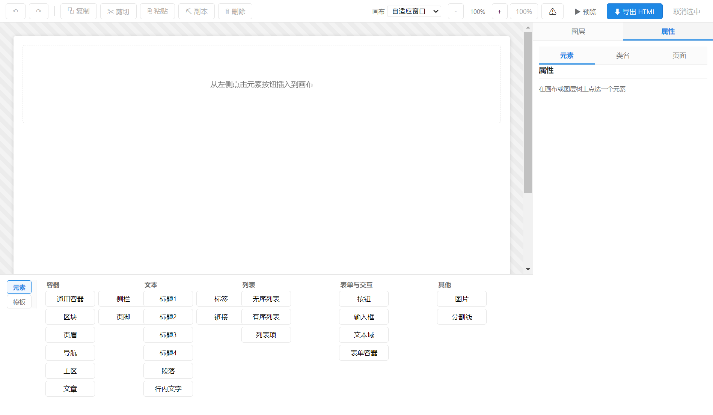
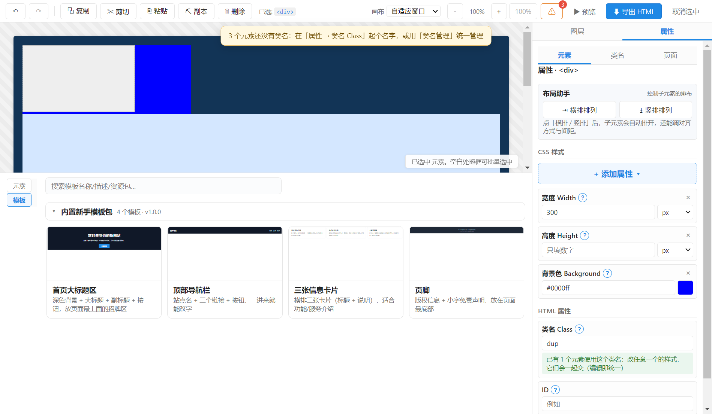

<p align="center">
  
</p>

<h1 align="center">BlockCanvas · 积木画布</h1>

<p align="center">
  <strong>让完全不懂代码的人，也能做出专业网页的桌面可视化编辑器</strong><br/>
  拖拖拽拽画界面 · 内置模板 · 后期接入 Scratch 式积木编程<br/>
  最终导出干净、可读、手写级的 HTML / CSS / JS
</p>

<p align="center">
  <a href="#"></a>
  
  
  
</p>

---

## 📖 项目简介

BlockCanvas（积木画布）是一个**可视化静态网页构建工具（WYSIWYG）**。核心目标是：**给零基础用户一个「可视化网页工厂」**，让你像用画图软件一样拖出界面，产物必须是手写级的干净代码，而不是一堆 `<div>` 山。

- 🖱️ 用鼠标拖拖拽拽就能搭出网页界面
- 🧩 内置大量模板资源包，一键插入
- 🧱 后期用 Scratch 式积木编程添加交互
- 📤 导出纯净、语义化、可读的 HTML + CSS（后续 +JS）

> 说人话：不懂代码，也能做出专业网页。

## ✨ 功能特性

- **所见即所得画布**：流式布局为主，元素可切换 `position`（static/relative/absolute/fixed/sticky），贴合真实网页行为
- **语义化元素系统**：`div / header / nav / section / main / article / aside / footer / 标题 / 段落 / 按钮 / 输入框 / 图片…`，导出不堆 `div`
- **属性面板**：盒模型 / 定位 / 颜色 / 字体 / 边框 / 阴影 / Flex（中文封装）实时预览
- **图层管理器**：树状 DOM，拖拽改层级 / 重命名 / 显隐 / 锁定
- **样式系统**：样式自动抽类（`.bc-s-*`）复用，同名冲突统一，导出干净 CSS
- **模板资源库**：内置资源包（Hero / 导航 / 卡片 / 页脚），按内容真实比例渲染缩略图，一键插入
- **扩展系统**：插件 + 资源包，统一放在程序目录 `extensions/`，支持导入 / 导出 / 启停
- **Undo / Redo**：全局可序列化单一数据源，所有操作可撤销/恢复
- **布局双模式**：左侧栏布局 / 底部栏布局（默认，画布最大）

## 🖼️ 截图

| 编辑器界面 | 底部布局 · 模板页 |
| --- | --- |
|  |  |

## 🛠️ 技术栈

| 层 | 选型 |
|---|---|
| 桌面壳 | Electron |
| 语言 | TypeScript |
| 前端框架 | React |
| 状态管理 | zustand |
| 包管理 | pnpm |
| 构建 | electron-vite (Vite) |
| 打包 | electron-builder |
| 积木编程（后期） | Google Blockly |
| 编辑器（后期） | Monaco Editor |

## 🚀 快速开始

### 环境要求

- Node.js ≥ 18（推荐 20+）
- pnpm ≥ 9
- Git

### 开发模式

```bash
pnpm install
pnpm dev
```

> 说明：桌面壳是 Electron，`pnpm dev` 会拉起一个本地窗口。

### 构建 / 类型检查 / 测试

```bash
pnpm typecheck      # TypeScript 类型检查
pnpm build          # 构建产物到 out/
pnpm test:e2e       # 构建 + 跑 Playwright 端到端测试
```

### 打包成便携版（Windows）

```bash
powershell -ExecutionPolicy Bypass -File build-exe.ps1
```

产物为 `dist\win-unpacked\`（绿色便携文件夹）+ `dist\BlockCanvas-0.3.0-win64.zip`。
绿色便携：**免安装、不写 AppData**；`extensions/` 放在 exe 旁边、可写，随时增删插件/资源包。

> 版本号规则：`0.X.X` = 阶段测试版，`X.X` = 正式版（如 1.0、2.3）。当前 `0.3.0`。

## 📁 目录结构

```
BlockCanvas/
├─ src/
│  ├─ main/          # Electron 主进程（窗口、菜单、IPC、扩展/导出/预览）
│  ├─ preload/       # 预加载脚本（window.bc 桥）
│  └─ renderer/      # React 界面（画布/元素面板/属性/图层/扩展管理…）
│     ├─ components/ # 各界面组件
│     ├─ lib/        # 导出器、样式类、插件宿主、类型、schema
│     ├─ store/      # zustand 状态（scene / toolbar）
│     └─ styles.css  # 全局样式
├─ extensions/       # 内置扩展（plugins 插件 + resources 模板资源包）
├─ docs/             # 文档与截图
├─ tests/e2e/        # Playwright 端到端测试
├─ tools/            # 辅助脚本（Logo 渲染等）
├─ electron-builder.yml  # 打包配置
├─ build-exe.ps1         # 一键打包脚本
└─ package.json
```

## 📚 文档

- [功能规划](docs/功能规划.md) —— 目标、设计原则、技术决策、路线图
- [开发历程](docs/开发历程.md) —— 按时间倒序的迭代记录
- [扩展规范](docs/扩展规范.md) —— 插件 / 资源包开发规范
- [图标设计](docs/图标设计.md) —— Logo 设计说明与重新生成方法

## 🧩 扩展系统

扩展统一放在程序目录 `extensions/` 下：

```
extensions/
├─ plugins/<id>/        # 插件（manifest.json + 执行代码）
└─ resources/<id>/      # 资源包（manifest.json + templates/*.json）
```

详细规范见 [扩展规范](docs/扩展规范.md)。在菜单「设置 → 插件与资源包」可导入 / 导出 / 启停扩展。

## 🗺️ 路线图

当前处于 **阶段 1（HTML 结构系统）** 并已完成阶段 0 / 部分阶段 2、3。完整规划见 [功能规划](docs/功能规划.md)。

- [x] 阶段 0：最小链路（拖元素 → 改样式 → 导出）
- [x] 阶段 1：HTML 结构系统
- [x] 阶段 2（Flex 封装 / 样式类系统）
- [x] 阶段 3（部分）：CSS 类名化 + 模板资源包 + 扩展管理
- [ ] 阶段 3-3：插件系统完整执行
- [ ] 阶段 4：响应式 / 对齐吸附 / 快捷键 / 工程文件
- [ ] 阶段 5：Scratch 式积木编程
- [ ] 阶段 6：发布（安装包、自动更新）

## 📄 许可证

[MIT](LICENSE) —— 自由使用、修改、再分发、商用。
